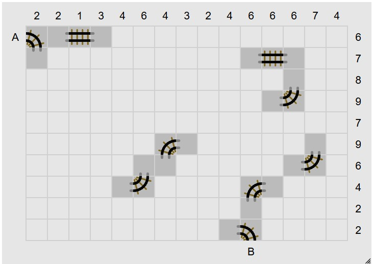
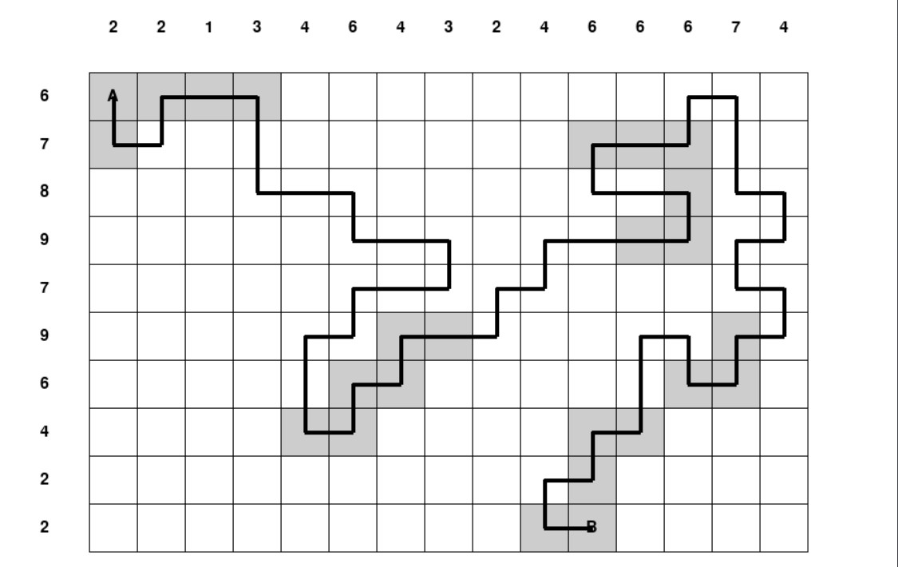
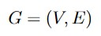
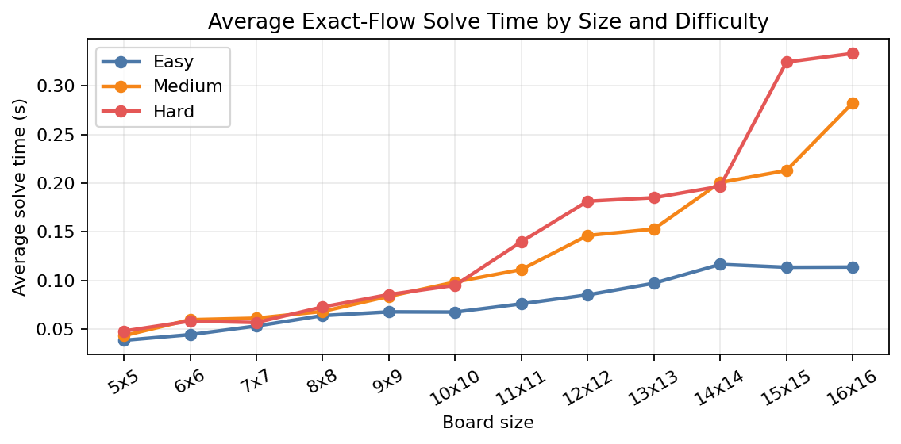

# Tracks Constraint Solver

## Soutenance Commands

These commands cover the course-required demonstrations: instance generation, terminal display,
UI display, solving several instances, and formatting results as a LaTeX table.

Create one instance:

```powershell
python -m tracks_solver.course_workflow generate-instance --rows 5 --cols 5 --seed 203 --output data/tracks/generated/soutenance_5x5.txt
```

Display the unresolved instance in the terminal:

```powershell
python -m tracks_solver.course_workflow display-grid data/tracks/generated/soutenance_5x5.txt
```

Solve one instance and display the solved ASCII grid:

```powershell
python -m tracks_solver.course_workflow solve-instance data/tracks/generated/soutenance_5x5.txt --time-limit 60 --display-solution
```

Open the solved instance in the Pygame UI:

```powershell
python -m tracks_solver.course_workflow open-ui data/tracks/generated/soutenance_5x5.txt --time-limit 60
```

Generate several instances:

```powershell
python -m tracks_solver.course_workflow generate-dataset --output-dir data/tracks/generated/soutenance --sizes 5x5,6x6,7x7 --count-per-size 2 --seed 203 --force
```

Solve several instances and write result files:

```powershell
python -m tracks_solver.course_workflow solve-dataset data/tracks/generated/soutenance --result-dir res/tracks/cbc/soutenance --csv-output res/tracks/cbc/soutenance_summary.csv --time-limit 60 --force
```

Format the results as a LaTeX table:

```powershell
python -m tracks_solver.course_workflow results-table --result-dir res/tracks/cbc/soutenance --output res/tracks/array_soutenance.tex
```

Optional playable mode, separate from the course-required sequence:

```powershell
python -m tracks_solver.main --play
```

Detailed explanation: [Soutenance Commands](docs/en/project/09_soutenance_commands.md)

A graph-based and optimization-oriented solver for the **Tracks** logic puzzle, implemented in
**Python** with a lightweight **Pygame** interface.

This repository is built around one clear idea: the puzzle is easier to understand, solve, and
defend when it is treated as a **graph feasibility problem** rather than as a purely visual grid
game.

## From Puzzle to Solution

<p align="center">
  
  
</p>
<p align="center">
  <em>Unsolved instance</em>
  &nbsp;&nbsp;&nbsp;&nbsp;
  <em>Current solved view</em>
</p>

## What This Project Contains

- a formal **MILP model** of Tracks based on the project report
- a Python implementation with instance parsing, graph helpers, PuLP/CBC solving, independent
  validation, ASCII rendering, and Pygame interfaces
- generated datasets and benchmark tooling
- a full English documentation set for the puzzle, the mathematical model, the code, the results,
  and the defense

## Project in One Paragraph

Tracks is a grid-based logic puzzle in which a single railway route must connect two terminals
while satisfying row and column clues and respecting fixed information. In graph terms, the grid
becomes a graph , the route becomes a selected connected subgraph with strict degree
conditions, and the puzzle becomes a feasibility problem. This repository translates that model
into Python through a parser, graph helpers, a solver, an independent validator, rendering tools,
and visual interfaces.

## Documentation First

Start here:

- [Project documentation index](docs/en/project/index.md)

Suggested reading paths:

**Quick defense path**

1. [From Puzzle to Graph](docs/en/project/01_from_puzzle_to_graph.md)
2. [Mathematical Model](docs/en/project/02_mathematical_model.md)
3. [Benchmark Results](docs/en/project/07_benchmark_results.md)
4. [Defense Preparation](docs/en/project/08_defense_prep.md)

**Full technical path**

1. [Project documentation index](docs/en/project/index.md)
2. [From Puzzle to Graph](docs/en/project/01_from_puzzle_to_graph.md)
3. [Mathematical Model](docs/en/project/02_mathematical_model.md)
4. [Code Architecture](docs/en/project/03_code_architecture.md)
5. [Solver Pipeline](docs/en/project/04_solver_pipeline.md)
6. [UI, Generation, and Data](docs/en/project/05_ui_generation_and_data.md)
7. [Validation and Testing](docs/en/project/06_validation_and_testing.md)
8. [Benchmark Results](docs/en/project/07_benchmark_results.md)
9. [Defense Preparation](docs/en/project/08_defense_prep.md)

Related material:

- [Formal report entry point](report/main.tex)
- [Installation guide](docs/en/installation.md)
- [Implementation guide](docs/guide/tracks_implementation_plan.md)

## Repository Overview

```text
tracks_solver/
  core/        # models, parser, graph helpers, validator, ASCII display
  solver/      # MILP model and solving helpers
  generation/  # random instance and dataset generation
  ui/          # Pygame viewer and playable UI

data/          # manual, dataset, and generated instances
res/           # benchmark outputs and result files
tests/         # parser, graph, solver, UI, and validation tests
report/        # LaTeX report
docs/          # project documentation and guides
```

## Quick Start

Use Python **3.11**, **3.12**, or **3.13** so `pygame` installs cleanly.

### 1. Install dependencies

```powershell
python -m pip install --upgrade pip
python -m pip install -r requirements.txt
```

### 2. Run the environment check

```powershell
python -m tracks_solver.main
```

### 3. Solve one instance

```powershell
python -m tracks_solver.main data/tracks/manual/small_4x4.txt
```

### 4. Open the UI

```powershell
python -m tracks_solver.main data/tracks/datasets/map_01_8x8_from_screenshot.txt --ui --time-limit 60
```

### 5. Open the playable mode

```powershell
python -m tracks_solver.main --play
```

## Benchmark Results

The current report benchmark uses only generated boards, from `5x5` to `16x16`, with `Easy`,
`Medium`, and `Hard` difficulty profiles and `10` instances per configuration. That gives `360`
benchmark instances in total, and the current exact-flow pipeline solves and validates all `360`.

- average solve time: about `0.078 s` on `Easy`
- average solve time: about `0.127 s` on `Medium`
- average solve time: about `0.148 s` on `Hard`
- Hard-instance generation is not zero; it is roughly `0.17` to `0.75 ms`, so it must be shown in
  milliseconds to be visible next to solver times in seconds

<p align="center">
  
</p>

For the full benchmark protocol, figure interpretations, and reproducibility commands:

- [Benchmark Results](docs/en/project/07_benchmark_results.md)

## Why the Modeling Matters

The central modeling point of the project is that **local constraints are not enough**.

Even if:

- every used internal cell has degree 2
- the terminals have degree 1
- the row and column clues are satisfied

the board may still contain a disconnected loop.

That is why the project uses:

- binary variables for used cells
- binary variables for selected adjacencies
- a **flow-based connectivity formulation** to force one valid route

This is the main mathematical idea of the project, and it is reflected directly in the code.

## Current Capabilities

- parse `.txt` puzzle instances
- support `fixed_used`, `fixed_empty`, `fixed_edges`, and `fixed_patterns`
- solve instances with MILP
- validate solver output independently
- render solutions in ASCII and Pygame
- generate solvable random instances
- solve datasets and export CSV summaries
- open a playable Pygame mode for generated or loaded boards

## Quality Checks

Run the test suite with:

```powershell
python -m pytest
```

The tests cover parsing, graph construction, validation, solver behavior, generation, and Pygame
rendering.

## What This Repository Is For

This project is not only about producing a solution grid. It is also about being able to explain:

- why Tracks is a graph problem
- why it is modeled as a feasibility MILP
- how the mathematical model becomes code
- why the implementation can be trusted

The best entry point for that story is:

- [Project documentation index](docs/en/project/index.md)
