# Mathematical Model

Why this matters:

The report gives the formal MILP model. This page explains the same model in documentation form so
that a reader can move from notation to meaning to implementation without treating the equations as
isolated symbols.

For the formal LaTeX version, see:
- [English mathematical model in the report](../../../report/sections/02_mathematical_model.tex)

## 1. Problem Statement

We consider a Tracks instance on an 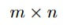 grid.
Two special cells are prescribed:

  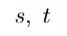

The goal is not to minimize a cost. The goal is to decide whether there exists a valid railway
route from the start terminal to the end terminal that satisfies:

- row and column clues;
- local track consistency;
- absence of branching;
- absence of disconnected components or extra loops;
- all fixed information provided in the instance.

This is therefore a **feasibility problem**. In standard MILP form, it is written with the dummy
objective:

  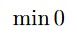

The objective is only a technical wrapper. The real content is entirely in the constraints.

## 2. Sets, Indices, and Parameters

The report uses the following notation:

  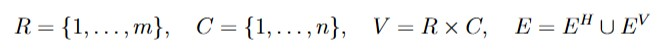

The horizontal and vertical edge subsets are:

  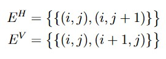

For neighborhood notation, we use:

  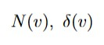

The terminals are:

  

The clue parameters are:

  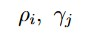

Fixed-information sets:

  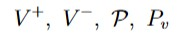

The necessary consistency condition is:

  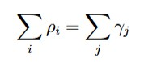

because both sides count the total number of used cells.

## 3. Decision Variables

The model uses three families of variables.

### Cell variables

For each cell in the grid:

  

These variables express row and column clues naturally.

### Edge variables

For each admissible undirected edge:

  

These variables express the geometry of the route.

### Flow variables

To enforce connectedness, the model uses directed arcs:

  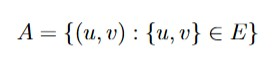

and for each arc:

  

This flow does not represent a physical train. It is an auxiliary mathematical device ensuring
that every selected cell can be reached from the source.

## 4. Constraint Families

### 4.1 Row and column count constraints

For every row:

  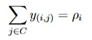

For every column:

  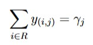

Plain-English meaning:

- each row must contain exactly the required number of used cells;
- each column must contain exactly the required number of used cells.

These are the direct translations of the puzzle clues.

### 4.2 Edge-cell consistency

For every admissible undirected edge:

  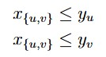

Plain-English meaning:

- if an edge is selected, both endpoint cells must be used;
- a connection cannot go into an empty cell.

This is a standard compatibility block between node-selection and edge-selection variables.

### 4.3 Terminal constraints

The terminals must be used:

  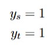

Their selected degree must be exactly one:

  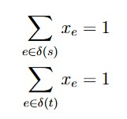

Plain-English meaning:

- the start and end cells are the two endpoints of the route;
- they have exactly one track connection each.

### 4.4 Internal degree constraints

For every non-terminal cell:

  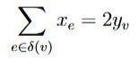

Plain-English meaning:

- if the cell is unused, its degree is zero;
- if the cell is used, its degree is exactly two.

This enforces local route continuity and prevents branching.

### 4.5 Fixed information

If a cell is forced to be used:

  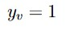

If a cell is forced to be empty:

  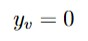

If a local pattern is prescribed, then:

  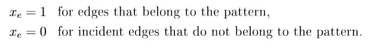

Plain-English meaning:

- fixed clues are encoded as hard constraints, not as preferences;
- a fully known clue cell behaves like a small local certificate of geometry.

### 4.6 Flow-based connectivity

For each directed arc, capacity is controlled by:

  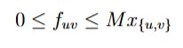

This means flow can use an arc only if the underlying undirected edge is selected.

At the source:

  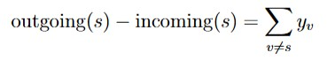

At every other vertex:

  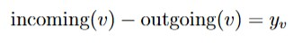

Plain-English meaning:

- the source sends one unit of flow to each other used cell;
- every used cell must absorb one unit;
- therefore every used cell must be reachable from the source through selected edges.

## 5. Why Degree Constraints Alone Are Not Enough

This is one of the most important ideas of the whole project.

Suppose the model contains:

- row and column clue constraints;
- edge-cell consistency;
- degree constraints.

Then an invalid configuration can still appear:

- one valid path from the start terminal to the end terminal;
- one extra disconnected cycle somewhere else.

Why does this happen?

Because every cell in that disconnected cycle still has degree 2, so the local constraints are all
satisfied. The failure is global, not local.

That is why the model needs a connectivity formulation in addition to degree constraints.

## 6. Why the Flow Formulation Removes Disconnected Loops

The flow formulation works by contradiction.

Suppose a disconnected component exists and does not contain the source.
Then:

- no flow can enter that component, because flow is limited to selected edges;
- but each used cell in that component requires one unit of net inflow.

These two facts are incompatible.

Therefore, every used cell must lie in the same connected component as the source.
Combined with the degree conditions, this excludes:

- disconnected paths;
- isolated loops;
- detached fragments;
- branches.

## 7. Alternative Connectivity Formulations

The project uses a single-commodity flow formulation because it is explicit, rigorous, and easy to
map into code. However, it is not the only valid option.

### Cut constraints

One can require that every selected subset not containing the source is connected to the rest of
the graph by at least one selected edge.

This leads to connectivity cuts of the form:

  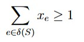

for appropriate selected subsets.

Advantage:

- closer to pure graph connectivity language.

Disadvantage:

- exponentially many potential cuts;
- they require an additional separation mechanism in practice.

### Subtour-style elimination

Because Tracks resembles a path-selection problem on a graph, one can also think in the style of
subtour elimination from TSP-like models.

Advantage:

- conceptually familiar in combinatorial optimization.

Disadvantage:

- again, it usually requires dynamic cut management instead of a compact first model.

For a first implementation, the flow approach is the most direct baseline.

## 8. Compact Mapping from Model to Code

| Mathematical object | Meaning | Where it appears in code |
| --- | --- | --- |
| `V` | set of cells | `tracks_solver/core/graph.py` via `build_grid_graph(...).cells` |
| `E` | admissible undirected edges | `build_grid_graph(...).edges` |
|  | neighbors / incident-edge notation | `build_grid_graph(...).neighbors` and `build_grid_graph(...).incident_edges` |
|  | used-cell variable | `tracks_solver/solver/milp.py` as `y[cell]` |
|  | selected-edge variable | `tracks_solver/solver/milp.py` as `x[edge]` |
|  | connectivity-flow variable | `tracks_solver/solver/milp.py` as `f[arc]` |
|  | fixed clues | parsed into `TracksInstance` in `tracks_solver/core/models.py` and `parser.py` |

The full mapping table is available in:
- [Model-to-Code Traceability](appendices/model_to_code_traceability.md)

## Key Takeaways

- The Tracks model is a feasibility MILP, not a cost-minimization problem.
- Cell variables express clue counts naturally; edge variables express geometry naturally.
- Degree constraints enforce local path structure, but not global validity.
- Flow constraints provide the global connectivity guarantee that removes isolated loops.

The next step is to understand how the repository mirrors this model at the architecture level.

Next: [Code Architecture](03_code_architecture.md)
