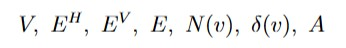
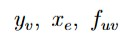

# Solver Pipeline

Why this matters:

The defense will likely include the question: "What happens, concretely, when you solve one
instance?" This page gives the full answer, step by step, and connects each stage to the
corresponding module.

## 1. Overview of the Runtime Flow

When the project solves one instance, the runtime pipeline is:

```text
text file
  -> parser
  -> normalized instance
  -> graph construction
  -> MILP variable creation
  -> MILP constraints
  -> PuLP/CBC solve
  -> solution extraction
  -> independent validation
  -> display
```

This order is deliberate. The solver is not asked to repair malformed input, and the UI is not
asked to guess whether the solution is correct.

## 2. Step 1: Parse an Instance

Main module:

- `tracks_solver/core/parser.py`

Main entrypoints:

- `parse_tracks_instance(path)`
- `parse_tracks_instance_text(text, source=...)`

What happens here:

- read the `.txt` representation;
- split it into `key=value` fields;
- validate required fields;
- parse coordinates, clue lists, cell sets, edge sets, and local patterns;
- normalize everything into a `TracksInstance`.

This is where syntax-level mistakes are detected, such as:

- a missing `end` field;
- a clue list of the wrong length;
- a fixed edge between non-adjacent cells;
- an invalid local pattern token.

## 3. Step 2: Normalize Fixed Information

Main module:

- `tracks_solver/core/models.py`

Main object:

- `TracksInstance`

The `TracksInstance` dataclass does more than store values. It normalizes and validates the model
data.

Important normalization work includes:

- converting coordinates to tuples;
- canonicalizing undirected edges;
- checking bounds;
- checking clue consistency;
- automatically adding the start and end cells to `fixed_used`;
- expanding `fixed_patterns` into implied fixed edges.

This design is important because it keeps the solver cleaner. By the time the solver receives the
instance, the fixed information already has a normalized meaning.

## 4. Step 3: Build Graph Structures

Main module:

- `tracks_solver/core/graph.py`

Main function:

- `build_grid_graph(instance)`

Output:

- `cells`
- `horizontal_edges`
- `vertical_edges`
- `edges`
- `neighbors`
- `incident_edges`
- `arcs`

This is where the mathematical objects

become concrete Python data.

The graph helper is intentionally deterministic. This matters for both debugging and testing.

## 5. Step 4: Create MILP Variables

Main module:

- `tracks_solver/solver/milp.py`

Main function:

- `solve_tracks_instance(instance, time_limit=None, msg=False)`

The MILP builder creates:

- `y[cell]` for used cells;
- `x[edge]` for selected undirected edges;
- `f[arc]` for directed flow values.

These correspond exactly to the report notation:

<p align="center">
  
</p>

The model objective is the constant `0`, because the problem is treated as a pure feasibility
model.

## 6. Step 5: Add Constraints

The solver then adds constraints in blocks.

### Row and column clues

These fix the number of used cells in each row and column.

### Edge-cell consistency

These ensure a selected edge cannot connect to an unused cell.

### Terminal constraints

These force the start and end to be used and to have degree 1.

### Internal degree constraints

These force every used non-terminal cell to have degree 2.

### Fixed information

These enforce:

- `fixed_used`
- `fixed_empty`
- `fixed_edges`

and, through normalization, the edge implications of `fixed_patterns`.

### Flow constraints

These guarantee global connectedness.

This layered construction matches the report closely enough that each family of constraints can be
explained by pointing to one mathematical rule.

## 7. Step 6: Solve with PuLP/CBC

Current solver backend:

- PuLP as the modeling layer
- CBC as the default MILP solver invoked by PuLP

At solve time, the code:

- builds the `LpProblem`;
- optionally applies a time limit;
- asks CBC to solve the model;
- reads the raw solver status;
- maps it into the project's own status vocabulary.

## 8. Step 7: Extract `TracksSolution`

Once PuLP returns, the solver collects:

- every cell with `y[cell] > 0.5`
- every edge with `x[edge] > 0.5`

and stores them in a `TracksSolution`.

The solution object also stores:

- normalized status;
- solve time;
- objective value;
- metadata such as number of variables, number of constraints, and validation details.

## 9. Step 8: Validate Independently

Main module:

- `tracks_solver/core/validation.py`

Main function:

- `validate_solution(instance, solution)`

This is one of the strongest design choices in the project. The solver does not trust itself.
After solving, the result is checked independently.

The validator verifies:

- row and column counts;
- edge-cell consistency;
- terminal degrees;
- internal degrees;
- fixed clues;
- connectedness of the selected subgraph;
- path-size consistency through
  .

If the solver returns a formally feasible solution that still violates the intended puzzle rules,
the solution status is downgraded to `invalid`.

## 10. Step 9: Display the Result

The project currently provides two output layers.

### ASCII view

Main module:

- `tracks_solver/core/display_ascii.py`

Use:

- quick debugging;
- text-only inspection of a solution;
- terminal output during development.

### Pygame view

Main module:

- `tracks_solver/ui/pygame_viewer.py`

Use:

- visual inspection of the board and route;
- clue display;
- terminal labels;
- rendering of selected tracks and fixed-cell shading.

## 11. Meaning of Fixed Hints

These four fields are important enough to be explained explicitly.

### `fixed_used`

Meaning:

- the cell must belong to the path.

It fixes a vertex-selection fact, but not the full local geometry.

### `fixed_empty`

Meaning:

- the cell must not belong to the path.

It excludes the cell from the selected subgraph.

### `fixed_edges`

Meaning:

- a particular adjacency between two neighboring cells must be selected.

It fixes an edge of the route, but not necessarily the complete local shape of the involved cells.

### `fixed_patterns`

Meaning:

- a given cell has a fully prescribed local track pattern.

Examples:

- `H`: horizontal piece
- `V`: vertical piece
- `UR`, `UL`, `DR`, `DL`: corner pieces
- `U`, `D`, `L`, `R`: terminal-like one-direction patterns

This is the strongest kind of local clue because it fixes all incident directions of the cell.

## 12. Why `fixed_patterns` Is Stronger Than `fixed_edges`

Suppose we know only:

```text
fixed_edges=2,2-2,3
```

This means the connection to the right exists. It does **not** determine whether `(2,2)` also
connects up, down, or left.

Now suppose instead we know:

```text
fixed_patterns=2,2:H
```

This means:

- `(2,2)` connects left;
- `(2,2)` connects right;
- `(2,2)` does not connect up or down.

So:

- `fixed_edges` fixes one adjacency;
- `fixed_patterns` fixes the whole local geometry of one cell.

Internally, `fixed_patterns` imply certain fixed edges, but not vice versa.

## 13. Solver Status Handling

The project currently distinguishes several statuses.

### `optimal`

The solver found a solution satisfying the MILP model and the independent validator accepted it.

### `feasible`

Reserved for a case where a feasible solution is available even if no proof of optimality is
returned. In this feasibility-only setting, it is close in spirit to `optimal`.

### `infeasible`

The solver proved that no solution exists for the given instance.

### `invalid`

The MILP solver returned a candidate solution, but the validator rejected it.

This should be rare, but keeping this state explicit is good engineering.

### `not_solved` or timeout-like states

These indicate the solver did not finish the search in a conclusive way within the current
conditions.

In those cases:

- the route may remain empty in the returned solution;
- no validated puzzle solution should be presented as correct.

## Key Takeaways

- The solver pipeline mirrors the mathematical model closely.
- Parsing and normalization happen before optimization.
- Validation happens after optimization and remains independent.
- `fixed_patterns` encode complete local geometry, while `fixed_edges` encode only selected adjacencies.

The next step is to look at the project from the outside: file format, manual and generated data,
viewer behavior, and current user-facing commands.

Next: [UI, Generation, and Data](05_ui_generation_and_data.md)
