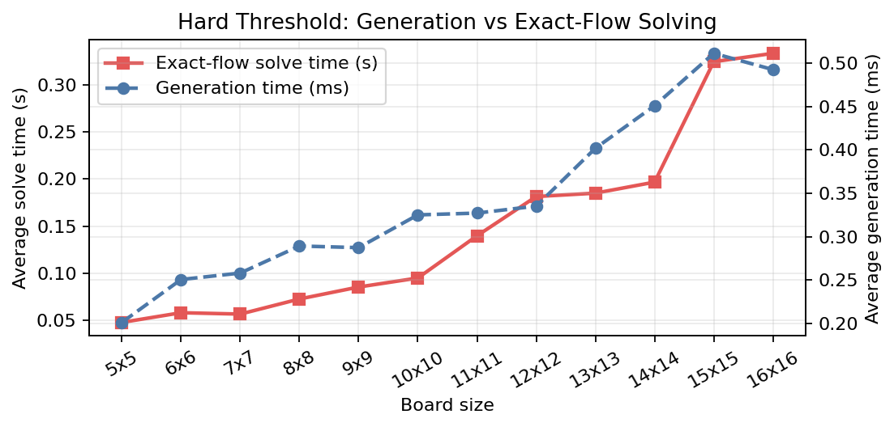
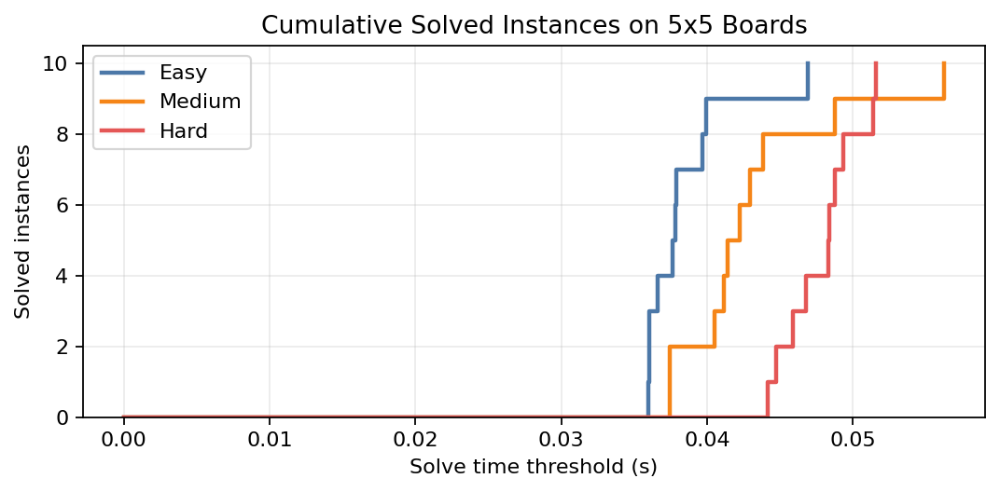
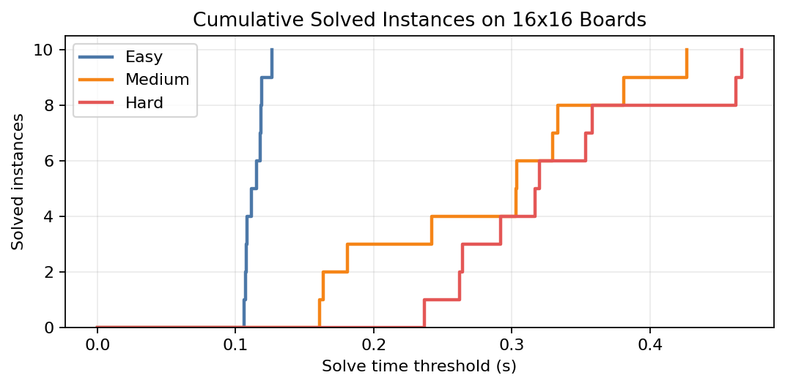

# Benchmark Results

Why this matters:

The project is not only a modeling exercise. It also needs an empirical story that shows how the
exact-flow formulation behaves as the board size and generation difficulty increase. This page
documents that story using the generated benchmark that also feeds the report.

## 1. Benchmark Scope

The current benchmark uses only generated instances. Manual instances and screenshot-derived maps
are useful for debugging and demonstrations, but they are not part of the standardized results
campaign.

The benchmark protocol is:

- sizes from `5x5` to `16x16`
- three difficulties: `Easy`, `Medium`, `Hard`
- `10` generated instances per `(size, difficulty)` pair
- `360` total instances
- exact MILP solving with `PuLP/CBC`
- `120` second time limit per instance

Main artifacts:

- instances: `data/tracks/generated/`
- benchmark CSV: `res/tracks/report/generated_benchmark_results.csv`
- figure scripts: `scripts/report_figures/`
- report figures: `report/sections/images/`

## 2. Aggregate Outcome

The benchmark currently contains:

- `360/360` generated instances solved to optimality
- `360/360` generated instances validated independently

Average solve times by difficulty:

- `Easy`: about `0.078 s`
- `Medium`: about `0.127 s`
- `Hard`: about `0.148 s`

Average generation times are much smaller than solve times:

- `Easy`: about `0.29 ms`
- `Medium`: about `0.36 ms`
- `Hard`: about `0.34 ms`

For Hard instances specifically, the observed generation times range from about `0.17 ms` to
`0.75 ms`. So generation is not zero; it is simply sub-millisecond and therefore visually tiny
compared with solver times measured in tenths of a second.

## 3. Figure 1: Generation vs Solve Time on Hard Instances

<p align="center">
  
</p>

This figure compares two very different costs:

- generation time, shown on the secondary y-axis in milliseconds
- exact-flow solve time, shown on the primary y-axis in seconds

This split is necessary because the two series differ by two to three orders of magnitude. The
important conclusion is that generation is effectively negligible in this workflow, while solving
becomes steadily more expensive as the board gets larger.

## 4. Cumulative Solved Curves

### `5x5` boards

<p align="center">
  
</p>

All `5x5` instances are solved quickly, regardless of difficulty. The three curves still separate
slightly, but the problem remains small enough that the exact model closes every run almost
immediately.

### `16x16` boards

<p align="center">
  
</p>

The `16x16` case is more informative. The spread between `Easy`, `Medium`, and `Hard` becomes much
clearer, which matches the intended difficulty design: longer paths and fewer hints leave more
freedom for the MILP to resolve.

## 5. Average Solve Time by Size and Difficulty

<p align="center">
  
</p>

This is the main scalability figure for the project.

Main takeaways:

- all three difficulty curves grow with board size
- `Hard` is generally above `Easy`
- the largest average times occur on `16x16` boards
- even the largest observed averages remain well below one second in the current benchmark

This does not mean the model is universally cheap. It means that, for the current generated corpus
and difficulty design, the exact-flow formulation remains practical across the tested range.

## 6. Why These Results Are Credible

The result story is stronger because it is not based on solver status alone.

Each benchmark row goes through this chain:

1. generate or load a normalized instance
2. solve it with the exact MILP backend
3. decode the selected cells and edges
4. validate the solution independently
5. write the metrics into the benchmark CSV

This means the plots are backed by both optimization output and semantic validation.

## 7. Reproducibility

The results can be reproduced from the repository.

Useful commands:

```powershell
python scripts/report_figures/summarize_generated_benchmark.py
python scripts/report_figures/plot_hard_threshold_generation_vs_solver.py
python scripts/report_figures/plot_cumulative_solved_5x5.py
python scripts/report_figures/plot_cumulative_solved_16x16.py
python scripts/report_figures/plot_average_solution_time_by_size_and_difficulty.py
```

The summary helper is useful when the README, report, or defense notes need to be updated from the
current CSV without manually recomputing the averages.

## Key Takeaways

- The benchmark is generated-only and fully standardized.
- Figure 1 needs separate units because generation is sub-millisecond while solving is not.
- The exact-flow solver scales predictably across `5x5` to `16x16` boards.
- Every reported solution is backed by an independent validator.

Next: [Soutenance Commands](09_soutenance_commands.md)
