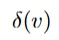
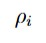
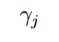
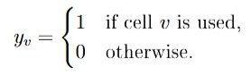
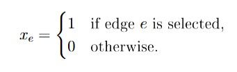
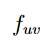
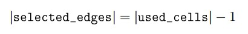

# Appendix: Model-to-Code Traceability

This appendix provides a direct mapping from the mathematical concepts of the report to the current
Python implementation.

## 1. Core Mathematical Objects

| Report notation | Meaning | Current implementation |
| --- | --- | --- |
| `R` | set of row indices | implicit in `range(instance.rows)` |
| `C` | set of column indices | implicit in `range(instance.cols)` |
| `V` | set of cells | `build_grid_graph(instance).cells` |
| `E^H` | horizontal edges | `build_grid_graph(instance).horizontal_edges` |
| `E^V` | vertical edges | `build_grid_graph(instance).vertical_edges` |
| `E` | admissible undirected edges | `build_grid_graph(instance).edges` |
| `N(v)` | neighbors of a cell | `build_grid_graph(instance).neighbors[cell]` |
|  | incident edges of a cell | `build_grid_graph(instance).incident_edges[cell]` |
| `A` | directed arcs | `build_grid_graph(instance).arcs` |

## 2. Instance Parameters

| Report notation | Meaning | Current implementation |
| --- | --- | --- |
| `s` | start terminal | `instance.start` |
| `t` | end terminal | `instance.end` |
|  | row clue | `instance.row_clues[i]` |
|  | column clue | `instance.col_clues[j]` |
| `V^+` | forced-used cells | `instance.fixed_used` |
| `V^-` | forced-empty cells | `instance.fixed_empty` |
| `\mathcal{P}` | cells with fixed local patterns | `instance.fixed_patterns.keys()` |
| `P_v` | required incident edges at one fixed-pattern cell | represented by `pattern_implied_edges(cell, pattern)` |

## 3. Decision Variables

| Report notation | Meaning | Current implementation |
| --- | --- | --- |
|  | used-cell binary variable | `y[cell]` in `tracks_solver/solver/milp.py` |
|  | selected-edge binary variable | `x[edge]` in `tracks_solver/solver/milp.py` |
|  | auxiliary flow variable | `f[arc]` in `tracks_solver/solver/milp.py` |

## 4. Constraint Families

| Mathematical block | Meaning | Current implementation |
| --- | --- | --- |
| Row-count constraints | used cells per row equal clues | `solve_tracks_instance(...)` in `milp.py` |
| Column-count constraints | used cells per column equal clues | `solve_tracks_instance(...)` in `milp.py` |
| Edge-cell consistency | selected edge implies used endpoints | `solve_tracks_instance(...)` in `milp.py` |
| Terminal use and degree | start/end used with degree 1 | `solve_tracks_instance(...)` in `milp.py` |
| Internal degree constraints | used non-terminals have degree 2 | `solve_tracks_instance(...)` in `milp.py` |
| Fixed information | enforce clue cells, edges, and empties | `TracksInstance` normalization + `milp.py` |
| Flow-capacity constraints | flow only through selected edges | `solve_tracks_instance(...)` in `milp.py` |
| Flow-balance constraints | enforce global connectedness | `solve_tracks_instance(...)` in `milp.py` |

## 5. Validation Counterparts

| Model concept | Independent check |
| --- | --- |
| clue satisfaction | `validate_solution(...)` recounts used cells by row and column |
| local degree rules | `validate_solution(...)` recomputes degrees from selected edges |
| fixed information | `validate_solution(...)` checks fixed cells, edges, and patterns |
| connectedness | `validate_solution(...)` performs reachability from `instance.start` |
| single-path size consistency | `validate_solution(...)` checks  on the selected subgraph |

## 6. Data and Presentation Layers

| Concept | Current implementation |
| --- | --- |
| parser-compatible text instances | `tracks_solver/core/parser.py` |
| normalized in-memory instance | `tracks_solver/core/models.py::TracksInstance` |
| normalized solver output | `tracks_solver/core/models.py::TracksSolution` |
| ASCII rendering | `tracks_solver/core/display_ascii.py` |
| Pygame rendering | `tracks_solver/ui/pygame_viewer.py` |
| one-instance solve wrapper | `tracks_solver/solver/solve_instance.py` |
| dataset solve wrapper | `tracks_solver/solver/solve_dataset.py` |
| random instance generation | `tracks_solver/generation/generate_instance.py` |

## 7. Practical Reading Rule

When explaining the project, use this traceability chain:

```text
report notation
  -> code object
  -> runtime behavior
  -> validation check
```

Example:

```text

  -> graph.incident_edges[cell]
  -> degree constraint in milp.py
  -> degree recomputation in validation.py
```

This is the fastest way to show that the implementation is faithful to the model.
